## about this project:
   As a programmer, sometimes I don't have to set up Userinterface first and then program, but it's not my job at all.The UI designer, like me, does not think it's his job, so there must be a program to combine the programmer with the UI designer.I got a lot of inspiration on GitHub, creating a PSDUnity that fully supports unity3d controls, which will change the process of making UI into a complete user interface. And all this will be done inside the unity3d engine

## 1.what this project can help you ?

*  load psd from file,preview it in unity;
*  create atlas、sprite or Textures in unity;
*  generate UGUI gameobject automaticly;

## 2.very simple to use.
 ### "Window/psd-preview" show preview psd in unity
 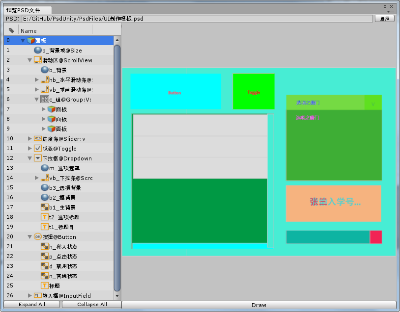
 ### "Assets/Create/Psd-Exproter" can define you ui holder
 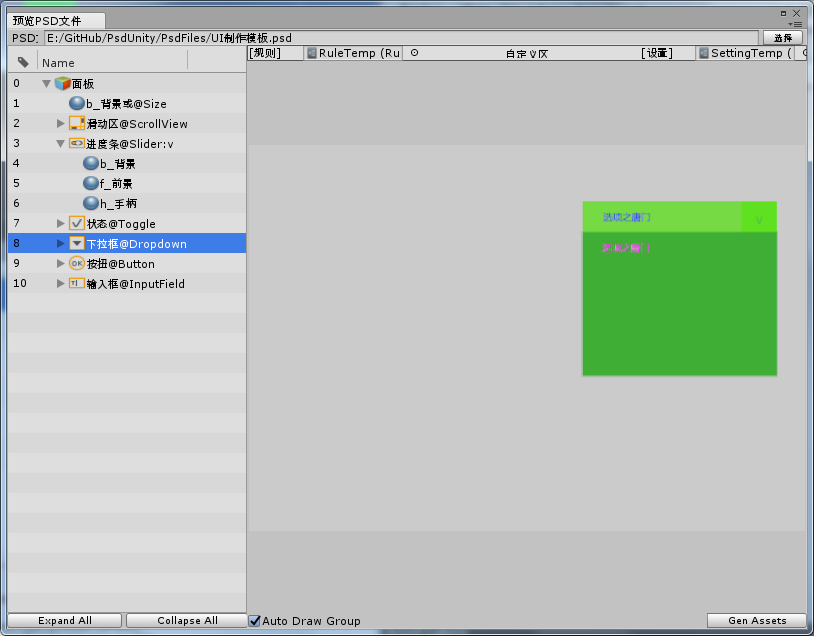
 ### "Runtime Import PSD from path"
 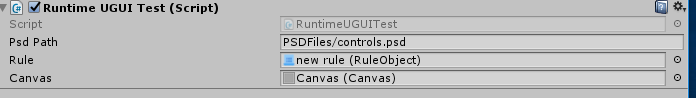
 ### Full Control Support 
 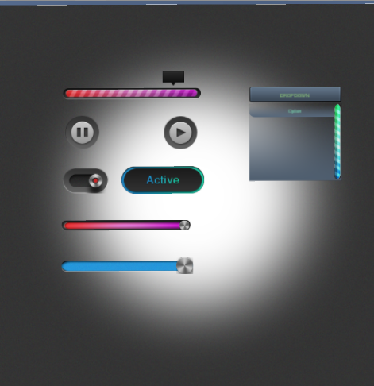
 ### Deep Enough Tree View   
 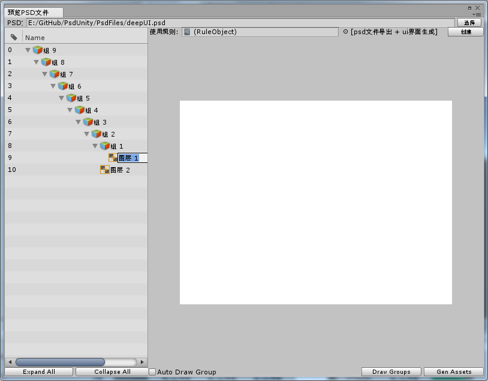
 ### InnerRules
 
 ### RuleObject 
 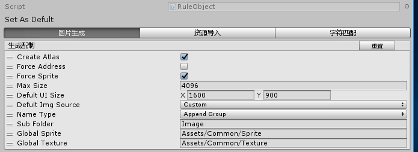
 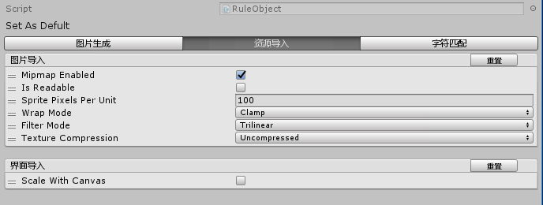
 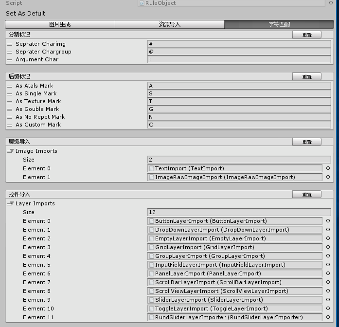
 ### Panel
 
 ### Text
 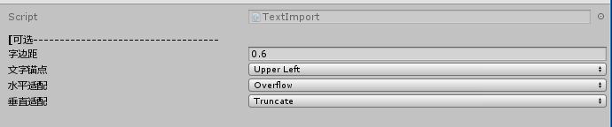
 ### Button
 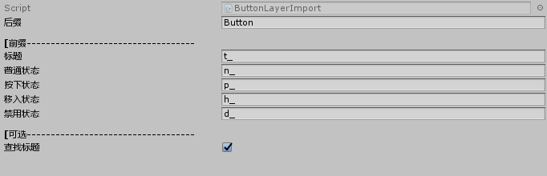
 ### Toggle
 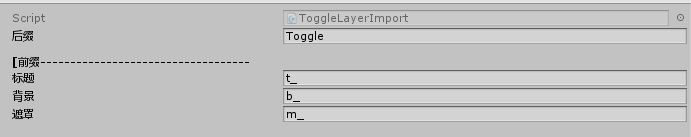
 ### InputField
 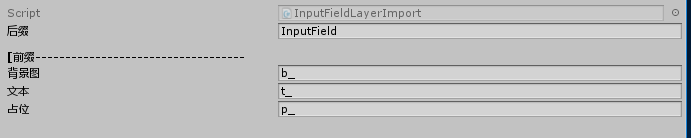
 ### Dropdown
 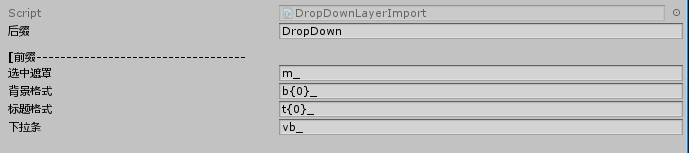
 ### Slider
 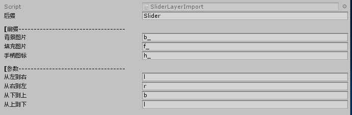
 ### Scrollbar
 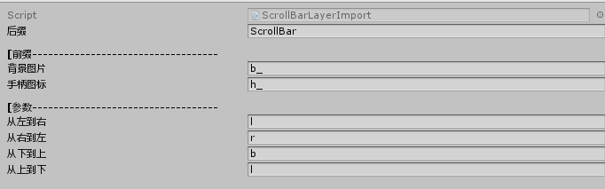
 ### ScrollRect
 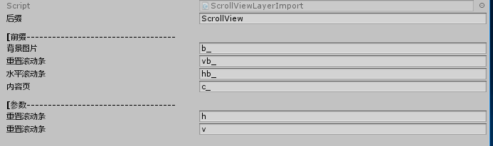
 ### Grid
 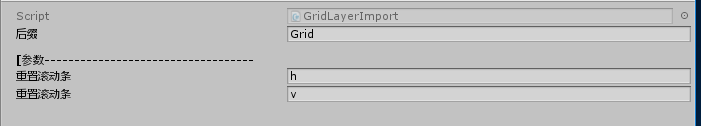
 ### Group
 
 ### you can define you own controls also!
 ...
## 3.Staps To Create UGUI?
 * 1.Create a psd file,add some layers Or groups,name it with our document:"图层命名规则.xlsx"
 * 2.Open you unity3d,click menu:"Asset/Create/Psd-Exproter"
 * 3.From generated scriptableObject,select the psd file you created
 * 4.click the button:"转换层级为图片，并记录索引"
 * 5.click the button:"Build-All“
 * 6.enjoy yourself
 
## 4.contact me.
* (when you have any question,or find some bugs,thank you to made me know.)
* this project path:[PsdUnity](https://github.com/zouhunter/unity-psd-ugui)
* qq邮箱:1063627025@qq.com

## 5.Thanks for this project
in this projects,I learned so much,mybe you need it also

* [Psd2UnityImporter](https://github.com/SubjectNerd-Unity/Psd2UnityImporter) 
* [psd-parser](https://github.com/NtreevSoft/psd-parser)
* [UnityPSDLayoutTool](https://github.com/GlitchEnzo/UnityPSDLayoutTool)
* [Unity Psd Importer](https://github.com/Banbury/UnityPsdImporter)
