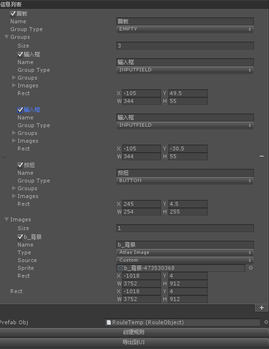
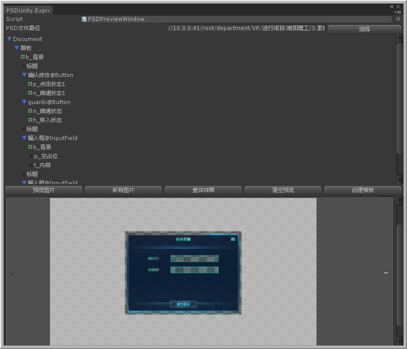
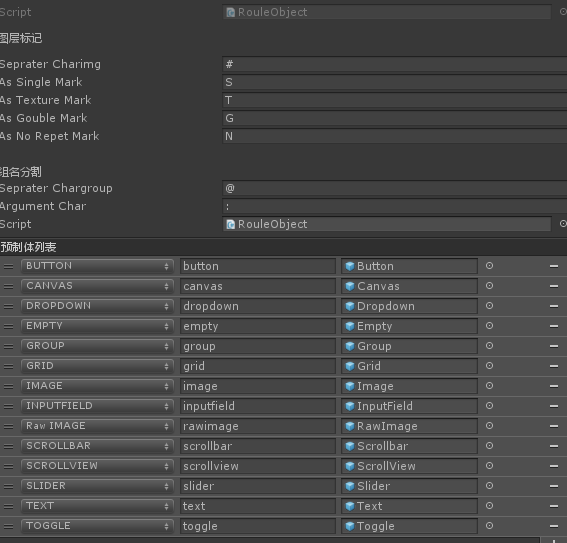

## about this project:
   as a programmer,sometime I have to make ui in unity ,and program later. but it just not my work at all,
   and the ui desiner dont think it is his job neither. last year we extend the Open Source project of PSD2UGUI
   to support my work,it`s excellent and useful.but the question is I have to Open PS to Exprot Sprite and 
   Import to Unity,that is so disappointed. however in github we fond some other Solution to use psd : 
   read *.psd file by c# replace ps place;

## 1.what this project can help you ?

*  load psd from file,preview it in unity;
*  create atlas、sprite or Textures in unity;
*  generate UGUI gameobject automaticly;

## 2.very simple to use.
 * "PsdUnity/ConfigWindow" show preview psd in unity
 
 *  in this window "创建模板" will show you how to make sprites and GameObjects quickly
 
 * you can define some roule about pslayer name
 

## 3.what next update?
 * script attachd prefab,when you change pictures,this link will continue exist,but rect and position will update

## 4.contact me.
* this project path:[PsdUnity](https://github.com/zouhunter/PsdUnity)
* QQ:1063627025 [when you have any question,or find some bugs,thank you to made me know.]

## 5Thanks for this project
in this projects,I learned so much,mybe you need it also

* [Psd2UnityImporter](https://github.com/SubjectNerd-Unity/Psd2UnityImporter) 
* [psd-parser](https://github.com/NtreevSoft/psd-parser)
* [UnityPSDLayoutTool](https://github.com/GlitchEnzo/UnityPSDLayoutTool)
* [Unity Psd Importer](https://github.com/Banbury/UnityPsdImporter)

### about deep seriation
until now i can`t find a good way to Serialize class of GroupNode,but find an option way below...;if you have good way ,thank you to warning me;
```
using System;
using UnityEngine;
using UnityEngine.Events;
using System.Collections;
using System.Collections.Generic;
using System.Runtime.Serialization;

namespace PSDUnity.Data
{
    public abstract class GroupNode : INameAnalyzing<GroupNode>
    {
        public string Name;
        public GroupType groupType;
        public Direction direction;
        public int constraintCount;
        public float spacing;
        public Rect rect;
        public abstract List<ImgNode> images { get; set; }
        public abstract List<GroupNode> groups { get; set; }
        public abstract GroupNode InsertChild(Rect rect);
        public void GetImgNodes(List<ImgNode> imgNodes)
        {
            if (images != null)
            {
                imgNodes.AddRange(images);
            }
            if (groups != null)
            {
                foreach (var item in groups)
                {
                    item.GetImgNodes(imgNodes);
                }
            }
        }

        public GroupNode Analyzing(RouleObject roule,string name)
        {
            string[] areguments = null;
            this.Name = roule.AnalysisGroupName(name, out groupType, out areguments);
            switch (groupType)
            {
                case GroupType.GRID:
                    if (areguments != null && areguments.Length > 1)
                    {
                        var key = areguments[0];
                        direction = RouleObject.GetDirectionByKey(key);
                    }
                    if (areguments != null && areguments.Length > 2)
                    {
                        var key = areguments[1];
                        constraintCount = int.Parse(key);
                    }
                    break;
                case GroupType.SCROLLVIEW:
                case GroupType.SLIDER:
                case GroupType.SCROLLBAR:
                    if (areguments != null && areguments.Length > 0)
                    {
                        var key = areguments[0];
                        direction = RouleObject.GetDirectionByKey(key);
                    }
                    break;
                case GroupType.GROUP:
                    if (areguments != null && areguments.Length > 1)
                    {
                        var key = areguments[0];
                        direction = RouleObject.GetDirectionByKey(key);
                    }
                    if (areguments != null && areguments.Length > 2)
                    {
                        var key = areguments[1];
                        spacing = float.Parse(key);
                    }
                    break;
                default:
                    break;
            }
            return this;
        }

        public GroupNode(Rect rect)
        {
            //利用名字解析controlType和arguments
            this.rect = rect;
        }

       
    }
    [System.Serializable]
    public class GroupNode1 : GroupNode
    {
        public List<GroupNode2> _groups = new List<GroupNode2>();
        public List<ImgNode> _images = new List<ImgNode>();

        public GroupNode1(Rect rect) : base(rect)
        {
        }

        public override List<ImgNode> images
        {
            get
            {
                return _images;
            }

            set
            {
                _images = value;
            }
        }
        public override List<GroupNode> groups
        {
            get
            {
                if (_groups == null) _groups = new List<GroupNode2>();
                return _groups.ConvertAll<GroupNode>(x => x);
            }

            set
            {
                _groups = value.ConvertAll<GroupNode2>(x => (GroupNode2)x);
            }
        }

        public override GroupNode InsertChild(Rect rect)
        {
            GroupNode2 node = new GroupNode2(rect);
            _groups.Add(node);
            return node;
        }
    }
    [System.Serializable]
    public class GroupNode2 : GroupNode
    {
        public List<GroupNode3> _groups = new List<GroupNode3>();
        public List<ImgNode> _images = new List<ImgNode>();

        public GroupNode2(Rect rect) : base(rect)
        {
        }

        public override List<ImgNode> images
        {
            get
            {
                return _images;
            }

            set
            {
                _images = value;
            }
        }
        public override List<GroupNode> groups
        {
            get
            {
                if (_groups == null) _groups = new List<GroupNode3>();
                return _groups.ConvertAll<GroupNode>(x => x);
            }

            set
            {
                _groups = value.ConvertAll<GroupNode3>(x => (GroupNode3)x);
            }
        }
        public override GroupNode InsertChild(Rect rect)
        {
            GroupNode3 node = new GroupNode3(rect);
            _groups.Add(node);
            return node;
        }
    }
    [System.Serializable]
    public class GroupNode3 : GroupNode
    {
        public List<GroupNode4> _groups = new List<GroupNode4>();
        public List<ImgNode> _images = new List<ImgNode>();

        public GroupNode3(Rect rect) : base(rect)
        {
        }

        public override List<ImgNode> images
        {
            get
            {
                return _images;
            }

            set
            {
                _images = value;
            }
        }
        public override List<GroupNode> groups
        {
            get
            {
                if (_groups == null) _groups = new List<GroupNode4>();
                return _groups.ConvertAll<GroupNode>(x => x);
            }

            set
            {
                _groups = value.ConvertAll<GroupNode4>(x => (GroupNode4)x);
            }
        }
        public override GroupNode InsertChild(Rect rect)
        {
            GroupNode4 node = new GroupNode4(rect);
            _groups.Add(node);
            return node;
        }
    }
    [System.Serializable]
    public class GroupNode4 : GroupNode
    {
        public List<GroupNode5> _groups;
        public List<ImgNode> _images = new List<ImgNode>();

        public GroupNode4(Rect rect) : base(rect)
        {
        }

        public override List<ImgNode> images
        {
            get
            {
                return _images;
            }

            set
            {
                _images = value;
            }
        }
        public override List<GroupNode> groups
        {
            get
            {
                if (_groups == null) _groups = new List<GroupNode5>();
                return _groups.ConvertAll<GroupNode>(x => x);
            }

            set
            {
                _groups = value.ConvertAll<GroupNode5>(x => (GroupNode5)x);
            }
        }
        public override GroupNode InsertChild(Rect rect)
        {
            GroupNode5 node = new GroupNode5(rect);
            _groups.Add(node);
            return node;
        }
    }
    [System.Serializable]
    public class GroupNode5 : GroupNode
    {
        public List<GroupNode6> _groups;
        public List<ImgNode> _images = new List<ImgNode>();

        public GroupNode5(Rect rect) : base(rect)
        {
        }

        public override List<ImgNode> images
        {
            get
            {
                return _images;
            }

            set
            {
                _images = value;
            }
        }
        public override List<GroupNode> groups
        {
            get
            {
                if (_groups == null) _groups = new List<GroupNode6>();
                return _groups.ConvertAll<GroupNode>(x => x);
            }

            set
            {
                _groups = value.ConvertAll<GroupNode6>(x => (GroupNode6)x);
            }
        }
        public override GroupNode InsertChild(Rect rect)
        {
            GroupNode6 node = new GroupNode6(rect);
            _groups.Add(node);
            return node;
        }
    }
    [System.Serializable]
    public class GroupNode6 : GroupNode
    {
        public List<GroupNode7> _groups;
        public List<ImgNode> _images = new List<ImgNode>();

        public GroupNode6(Rect rect) : base(rect)
        {
        }

        public override List<ImgNode> images
        {
            get
            {
                return _images;
            }

            set
            {
                _images = value;
            }
        }
        public override List<GroupNode> groups
        {
            get
            {
                if (_groups == null) _groups = new List<GroupNode7>();
                return _groups.ConvertAll<GroupNode>(x => x);
            }

            set
            {
                _groups = value.ConvertAll<GroupNode7>(x => (GroupNode7)x);
            }
        }
        public override GroupNode InsertChild(Rect rect)
        {
            GroupNode7 node = new GroupNode7(rect);
            _groups.Add(node);
            return node;
        }
    }
    [System.Serializable]
    public class GroupNode7 : GroupNode
    {
        public GroupNode7(Rect rect) : base(rect)
        {
        }

        public override List<ImgNode> images { get { return null; } set { } }
        public override List<GroupNode> groups { get; set; }
        public override GroupNode InsertChild(Rect rect)
        {
            Debug.Log("cant Insert");
            return null;
        }
    }
}


```
